🛋️ MyHouse – Site E-commerce de Meubles avec Django

📌 Présentation

MyHouse est une application web e-commerce développée avec Django permettant aux utilisateurs de parcourir des produits de mobilier, rechercher des articles, gérer un panier, passer des commandes et administrer leur compte utilisateur.

Ce projet simule une véritable boutique de meubles en ligne avec :

authentification,
gestion des commandes,
système de paiement,
avis clients,
dashboard administrateur.

🚀 Fonctionnalités

👤 Fonctionnalités Utilisateur

Inscription et connexion
Gestion du profil utilisateur
Navigation des produits
Recherche de produits
Filtrage par catégorie
Gestion du panier
Validation de commande
Historique des commandes
Avis et notes sur les produits

🛠️ Fonctionnalités Administrateur

Dashboard administrateur
Gestion des produits
Gestion des catégories
Gestion des commandes
Gestion des utilisateurs

🧰 Technologies Utilisées

Backend

Python
Django
Django ORM
MySQL
Frontend
HTML5
CSS3
Bootstrap
JavaScript

Outils

Git
GitHub
VS Code

📂 Structure du Projet

accounts/
carts/
category/
orders/
store/
templates/
static/
manage.py
requirements.txt
README.md

📸 Captures d’écran

👤 Connexion utilisateur

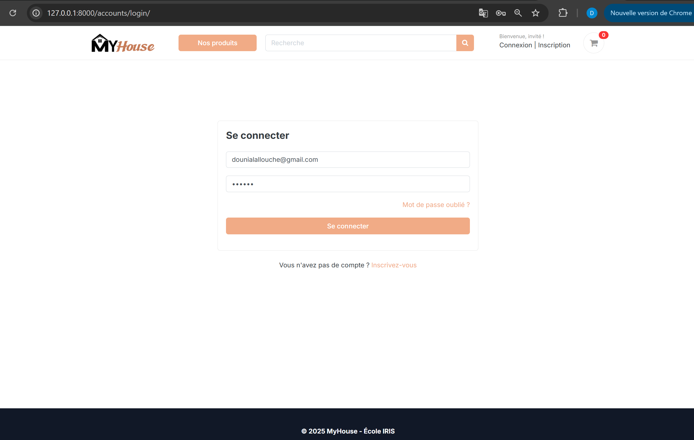

Système d’authentification sécurisé.

🔐 Connexion administrateur

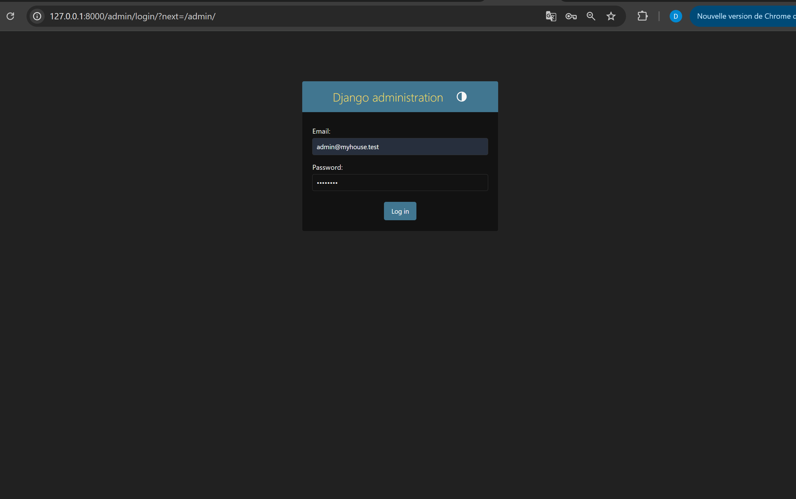

Espace dédié à l’administration.

📝 Inscription utilisateur

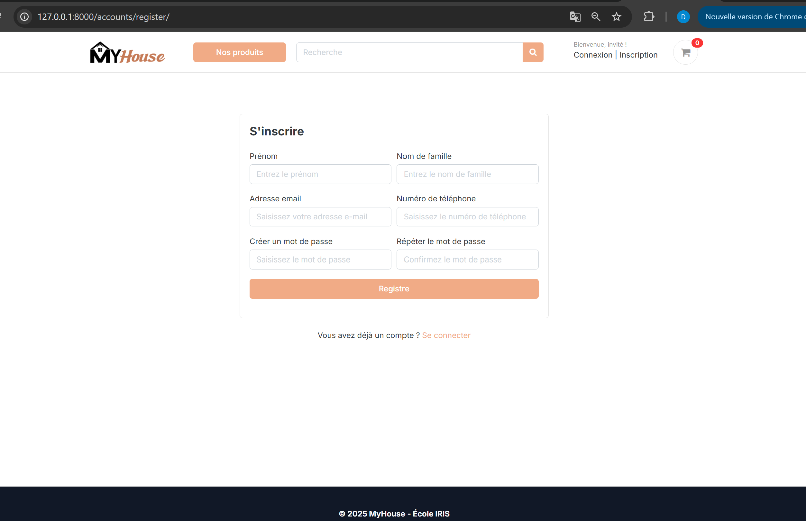

Création de compte utilisateur.

👤 Dashboard utilisateur

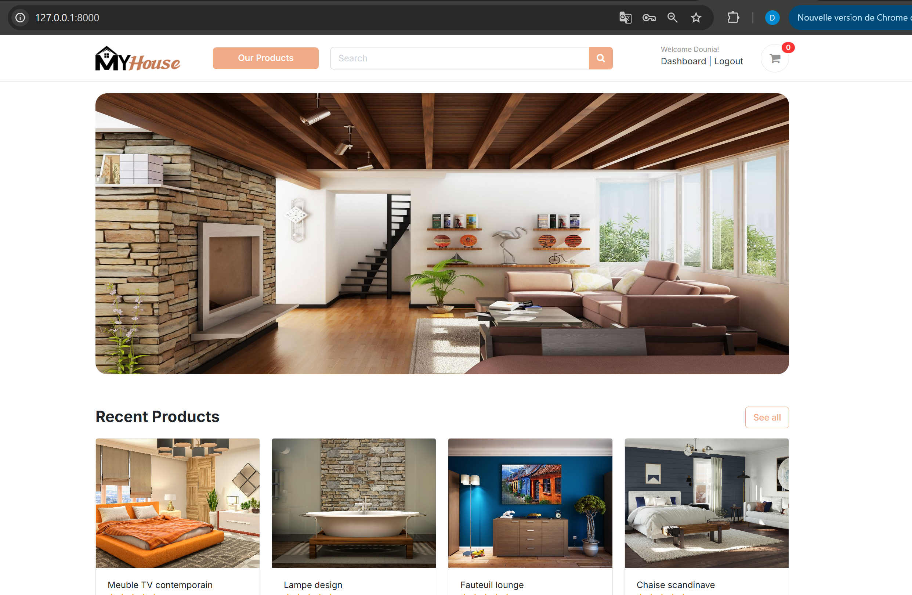

Gestion du compte et des commandes.

👤 Gestion du profil

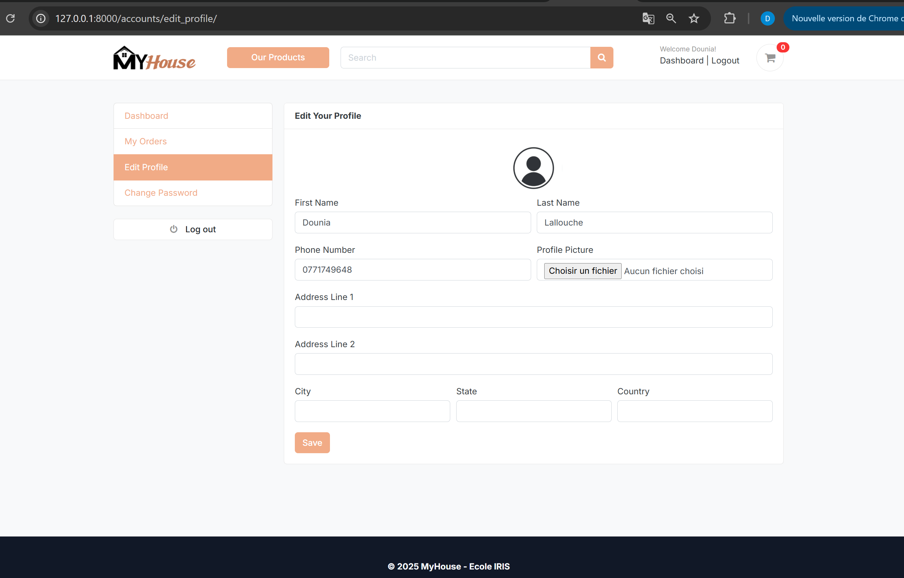

Modification des informations personnelles.

🛒 Panier

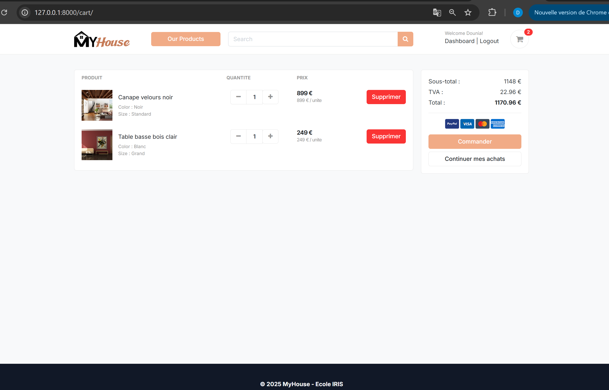

Gestion des produits ajoutés au panier.

💳 Validation de commande

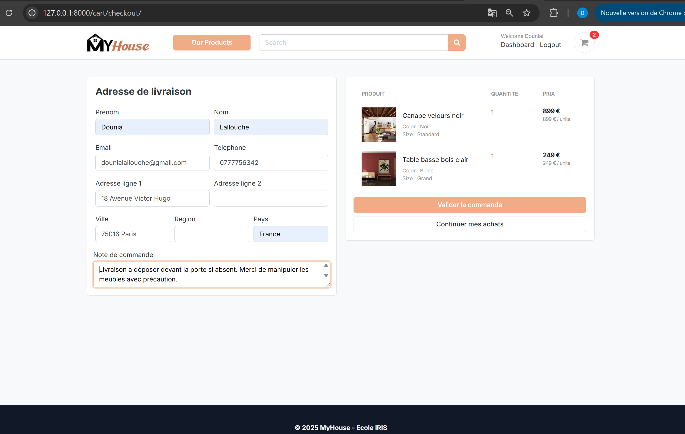

Interface complète de validation de commande.

💰 Paiement

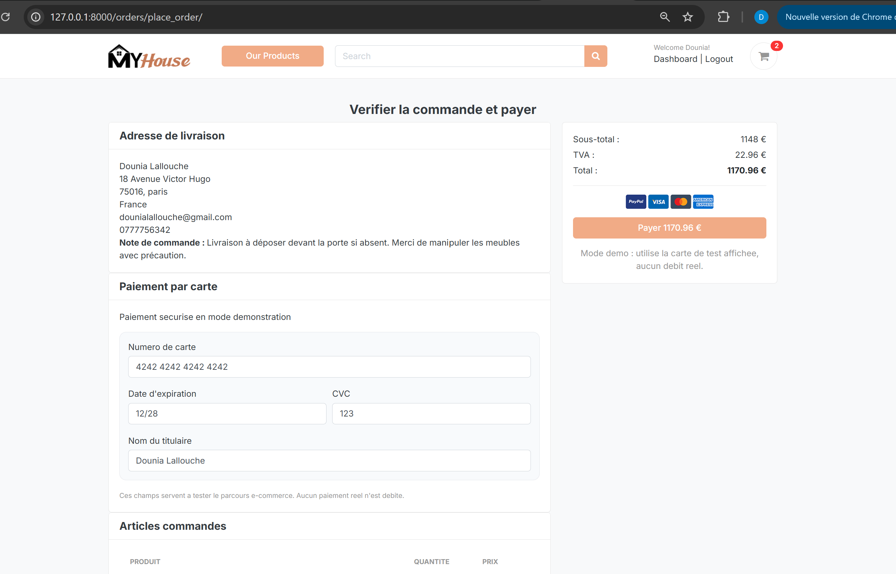

Système de traitement du paiement.

✅ Confirmation de paiement

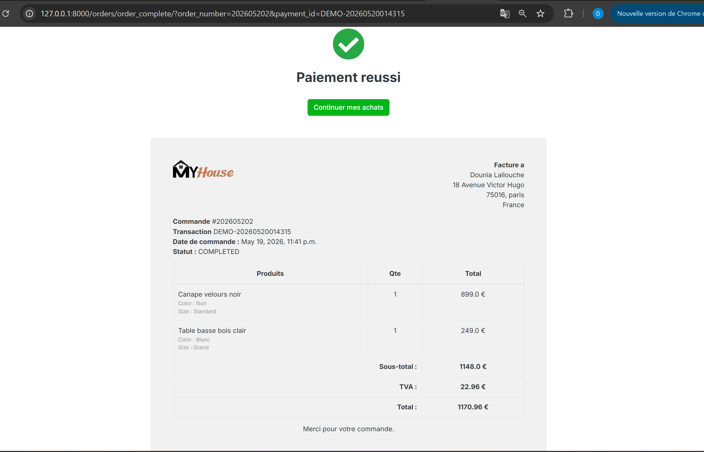

Confirmation de commande après paiement.

📦 Historique des commandes

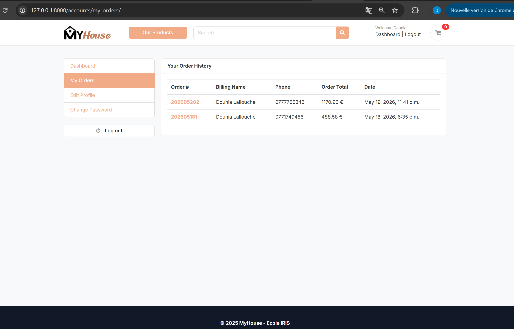

Consultation des anciennes commandes.

⭐ Avis et notes

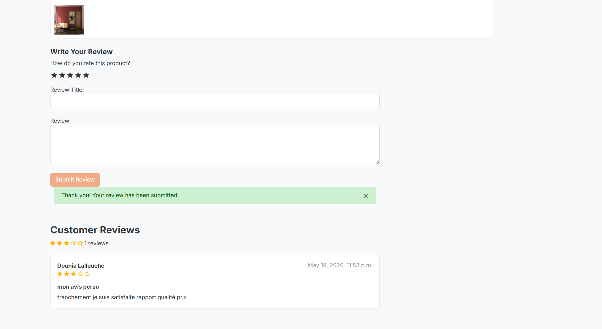

Système d’avis clients et notation.

🔎 Recherche de produits

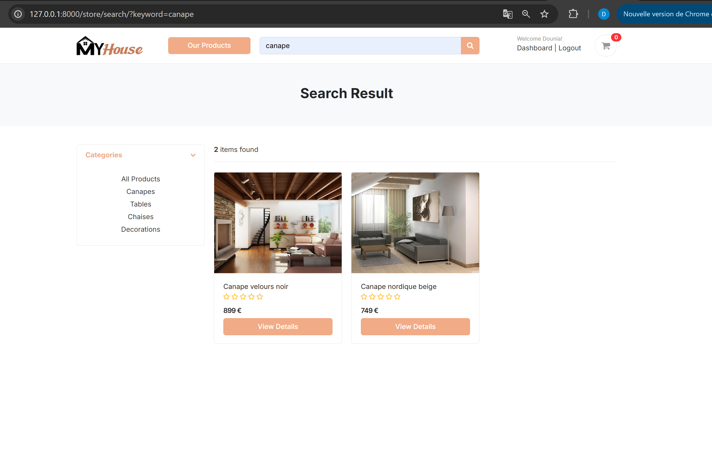

Recherche rapide de meubles et produits.

⚙️ Dashboard administrateur

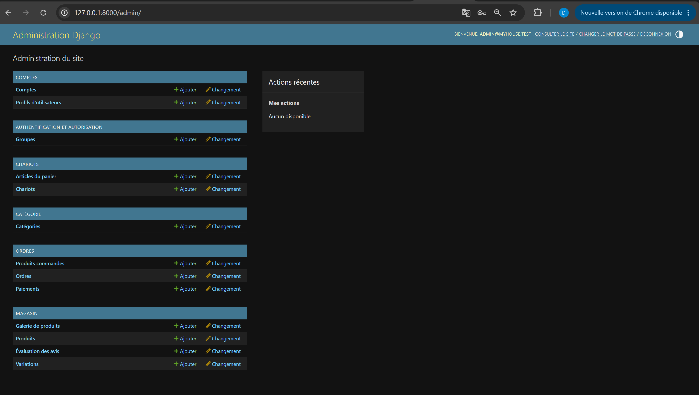

Gestion des produits et commandes.

⚙️ Installation

1️⃣ Cloner le projet

git clone https://github.com/dounia-lall/myhouse-django-ecommerce.git

cd myhouse-django-ecommerce

2️⃣ Créer un environnement virtuel

python -m venv .venv

3️⃣ Activer l’environnement virtuel

Windows
.venv\Scripts\activate
Linux / MacOS
source .venv/bin/activate

4️⃣ Installer les dépendances

pip install -r requirements.txt

5️⃣ Configurer les variables d’environnement

Créer un fichier .env :

DB_NAME=your_database
DB_USER=root
DB_PASSWORD=your_password
DB_HOST=localhost
DB_PORT=3306

6️⃣ Appliquer les migrations

python manage.py migrate

7️⃣ Lancer le serveur

python manage.py runserver

Accéder au site :

http://127.0.0.1:8000/

🎯 Compétences Développées

Ce projet m’a permis de développer mes compétences en :

Développement web avec Django

Architecture backend

Gestion de base de données MySQL

Authentification utilisateur

Workflow e-commerce

Intégration frontend/backend

Architecture MVC/MVT

Utilisation de Git et GitHub

📌 Améliorations Futures

Intégration de Stripe

Déploiement avec Docker

API REST

Notifications email

Wishlist

Responsive design avancé

👩‍💻 Auteur
Dounia Lallouche
